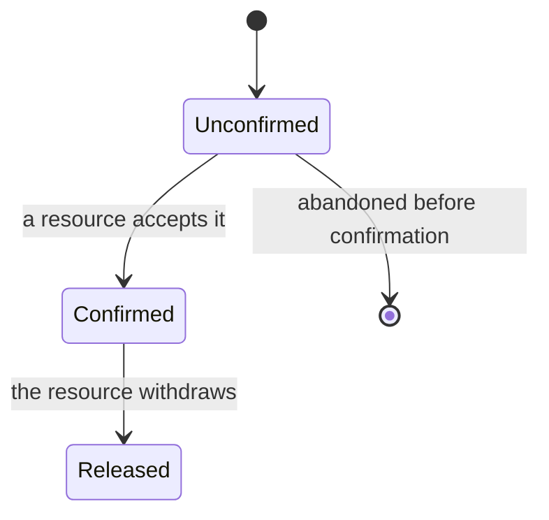
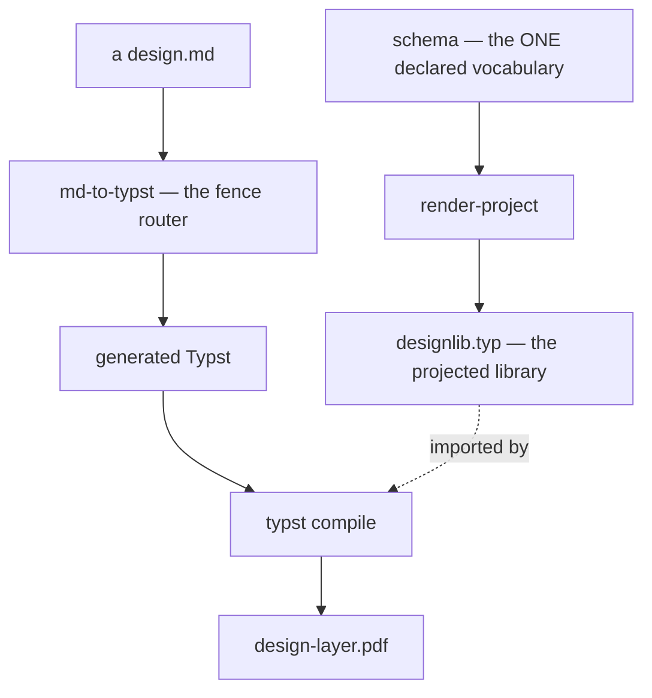
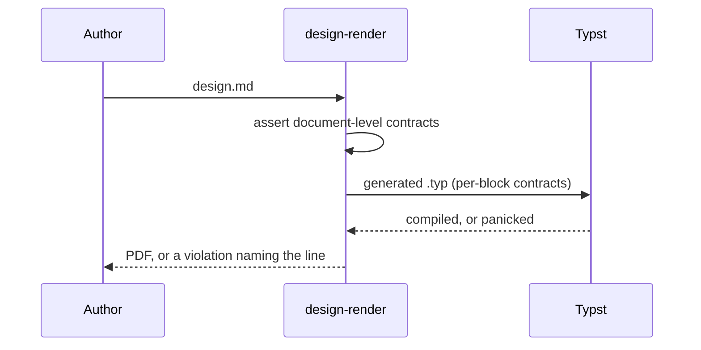

## How this file is rendered

The gate is `scripts/design-render`, not the renderer alone. It runs three
phases in order. **Assert** folds over the authored Markdown and checks the
document-level contracts — foundation cardinality and order, pending-entry
validity, spine order. **Prerender** hands the file to `scripts/md-to-typst`,
the fence router, which emits Typst that calls the projected library.
**Compile** runs Typst, whose per-block functions panic on a broken contract.
The rendered artifact is `widget-gallery.pdf`. There is no HTML.

The block set below is not a wish list. It is exactly the function set that
`scripts/render-project` projects from `schema/design-schema.json` into
`designlib.typ`. A block kind that the projection does not define does not
render, so it does not appear here as a live demonstration.

```bash
# project the schema fresh, then render this fixture and check it is clean
./scripts/render-project schema/design-schema.json fixtures/.render
DESIGN_LIB_DIR=fixtures/.render ./scripts/design-render fixtures/widget-gallery.md
DESIGN_LIB_DIR=fixtures/.render ./scripts/design-render fixtures/widget-gallery.md --check
```

## Typed statements

The foundation vocabulary. Four block kinds, each coloured by its own entry in
the projected `KIND_COLOR` token table. A statement renders as a left accent
rule, the kind label, the title, the body, and then a **footer** carrying
`lens` and `enforcement` as declared furniture. The footer is
a declared slot, not a markup convention: the author writes attributes and the
library places them.

:::goal {title="A design either renders or names why not"}
Every block contract is enforced fail-closed at render time, so a broken
design document never produces a document that looks trustworthy.
:::

:::no-goal {title="Not a proof of good design"}
The gate proves a document is well-formed. It has no opinion on whether the
design behind it is a good one.
:::

:::invariant {title="One schema, no forked copies" enforcement=convention}
Every vocabulary the library carries — enums, block contracts, the token
table — is read from the schema at projection time, never re-typed by hand.
:::

:::invariant {title="Every referenced token is defined" enforcement=mechanism}
`enforcement` is the honest label for HOW a property is held — `mechanism` (a
check decides it), `partial` (a check decides its mechanical shadow), or
`convention` (discipline). It names the kind, never the enforcer: finding which
check holds a property is the gate's own job, not a pointer the document carries
and a human keeps current.
:::

:::principle {title="Model the domain before judging the structure" lens=modeling}
Carve the right entities first — wrong entities sink every other lens.
:::

:::principle {title="Make illegal states unrepresentable" lens=invariants+robustness}
Enforcement by construction beats enforcement by hope. A `lens=` combo is
split on `+`, each part checked against the lens enum, and the pill is drawn in
the schema's fixed lens order — not the order they were written.

An inline pill is also available in prose: `lens:state+composition` renders the
same furniture mid-sentence.
:::

## Behavior rules

The `:::behavior` block: a conditional rule — a context, one event, one or more
observable outcomes — carried by nested clause blocks, never prose. `level=`
selects which vocabulary the clauses may use. Both levels appear below; a rule
belongs to exactly one of them, never both. The level rides in the statement
footer as a declared chip.

::::behavior {title="A duplicate address is refused without disclosure" level=interface}

:::given
a visitor is not signed in
:::

:::when
they submit a sign-up whose address is already registered
:::

:::then
the sign-up is refused and the offending field is named
:::

:::then
the response never reveals that the address is already registered
:::

::::

An `interface` rule is the only place interaction-over-time can be stated — a
boundary has no notion of a visitor waiting.

::::behavior {title="A slow upload reports progress and stays cancellable" level=interface}

:::given
an upload is in flight
:::

:::when
the visitor waits for it to finish
:::

:::then
the visitor is shown that it is progressing and can cancel it
:::

:::then
a cancelled upload leaves no partial file visible to the visitor
:::

::::

A `boundary` rule states integrity in the domain's own language, which no
interface rule can express.

::::behavior {title="A transfer moves money atomically" level=boundary}

:::when
a transfer is requested between two accounts
:::

:::then
the source is debited and the destination credited, or neither changes
:::

::::

## Entity census

One entry per entity in a core model context. Every attribute carries its
**provenance** — how the fact arises — and every relationship carries its
declared **cardinality**; both render as chips ahead of the clause text. A
stateful entity's machine lives outside the block, in the census's own
lifecycle subsection.

::::entity {title="Booking" kind=aggregate owner="scheduling" lifecycle=stateful domain="scheduling" tint=violet}

:::attribute {provenance=authored}
the requested time window, stated by the person booking
:::

:::attribute {provenance=derived}
the duration, computed from the requested window
:::

:::attribute {provenance=observed}
the confirmation reported by the external calendar
:::

:::relates {cardinality="n : 1"}
belongs to one **Customer**
:::

:::relates {cardinality="1 : 0..n"}
references **Resources**
:::

::::

::::entity {title="Resource" kind=entity owner="scheduling" lifecycle=immutable domain="scheduling" tint=violet}

:::attribute {provenance=authored}
the resource's name and capacity
:::

:::relates {cardinality="1 : 0..n"}
referenced by **Bookings**
:::

::::

::::entity {title="Tariff" kind=value-object owner="pricing" lifecycle=immutable domain="pricing" tint=amber}

:::attribute {provenance=authored}
the rate and the currency it is quoted in
:::

::::

::::entity {title="Cancellation" kind=event owner="scheduling" lifecycle=append-only domain="scheduling" tint=violet}

:::attribute {provenance=observed}
the moment the booking was withdrawn, recorded when it happened
:::

::::

### Lifecycles

A stateful entity's machine lives here, outside its census entry — every one
naming its vacant state and its revoked-blessing transition.

#### Booking



Unconfirmed is the vacant state — the Booking before any resource has blessed
it. Released is the revoked-blessing transition: the resource withdraws while
the Booking is already confirmed.

## Card grids

The `:::cards` block: a run of `### title` cards in one grid. `cols=2|3|4` and
six `tint=` families. The column count is **derived from content**, not taken
on faith: a card set whose longest body runs past a threshold stacks into one
column, because a paragraph of prose in a narrow column reads badly.

:::cards {cols=3}

### schema

The one declared vocabulary: block contracts, anchors, enums.

### render-project

Projects the schema into the Typst library every compile imports.

### layer-integrity

Checks every cross-link, every ADR, every glossary term.
:::

:::cards {tint=teal cols=3}

### teal

The modeling / artifact family.

### violet

Swap `tint=` for violet, amber…

### slate

…blue, rose, slate. Each keys a token.
:::

## Stat tiles

`:::stat-grid` wrapping `:::stat-tile` children — KPIs read as one row. The
router reads the tiles out of the container and hands the library a real grid,
so they sit side by side rather than stacking.

::::stat-grid

:::stat-tile {value=4 label="Statement kinds"}
:::

:::stat-tile {value=6 label="Lenses"}
:::

:::stat-tile {value=6 label="Tints"}
:::

:::stat-tile {value=3 label="Enforcement levels"}
:::

::::

## Admonitions

Two kinds — `:::info` and `:::warning` — each taking a `title=` and any of the
six `tint=` families. The tint selects the colour from the projected
`TINT_COLOR` table; with no tint the block falls back to its kind's own colour.

:::info {title="One schema" tint=violet}
The schema is the only place a block's contract, an enum's members, or a
colour token is declared — the projector reads it, never a hand-kept copy.
:::

:::info {title="No tint, no problem"}
With no `tint=`, an admonition falls back to its own kind's colour. With no
`title=`, the kind name itself is shown, upper-cased, as the label.
:::

:::warning {title="Freshness is checked, not assumed"}
`design-render --check` and `design-aggregate --check` regenerate the
document and byte-compare it against the committed PDF — a stale artifact is
reported, never silently repaired.
:::

:::warning {title="A figure names what it uses" tint=rose}
A `:::figure` block's `uses=` list is restricted to the packages this
repo's flake vendors. An import outside that set fails the render, so a
design layer stays reproducible offline.
:::

## Pending-ledger entries

`:::pending {kind=… since=…}` — a promised-but-unbuilt delta. Four kinds
(build / verify / foundation / ruling). `since` is load-bearing rather than
decorative: it is validated as `YYYY-MM-DD` and rides in the footer, so an
aging entry is visible as design debt.

:::pending {title="A hypothetical unbuilt delta" kind=build since=2026-08-16}
A `build` entry names something designed but not yet built. It must cite its
decision as a real link whose fragment is `#adr-NNNN`; this gallery cites its
own illustrative anchor below rather than a live decision record, so
demonstrating the block never couples the look tripwire to a real ADR set.
See [ADR-0000](#adr-0000).
:::

<a id="adr-0000"></a>

_The citation target above: an illustrative anchor, so this reference resolves
within the gallery. A real `build` entry links a real decision record._

:::pending {title="Fill goals a derivation cannot produce" kind=foundation since=2026-07-01}
Foundation content a system cannot yield on its own — why it exists, what it
deliberately excludes — waits here until a human states it.
:::

:::pending {title="Re-check the token table against a printed page" kind=verify since=2026-08-10}
A tint chosen on a screen is not proven on paper.
:::

:::pending {title="Render and validate via Typst" kind=ruling since=2026-08-01}
:::

## Diagrams

A diagram is authored as a fenced code block tagged `mermaid`.
It is **always converted** to a carrier — never passed through, and never
themed by a stylesheet. The author writes declarative source, nodes and edges
only; the fence router reads the diagram's shape and hands it to the carrier
that draws it: a flowchart or state machine becomes a Graphviz DOT graph with
real layout, a sequence diagram goes to the sequence carrier. An authored
design document therefore never contains renderer markup.

The conversion declares the grammar it supports, and that declaration is the
contract. A construct inside the boundary converts; a construct outside it
fails the gate naming the construct and the line. It is never silently dropped
and never degraded into a placeholder a reader could mistake for the drawing.

Diagram colour comes from the same projected token table the blocks use — the
lens, tint, and kind colours generated into `designlib.typ` — so a token change
moves the blocks and the diagrams together.





## Figures

`:::embedded-svg` names a figure by its sibling file and renders a captioned
frame for it. The source is a file reference; the block does not accept
arbitrary inline markup, because a design document holding renderer markup is
a program rather than a reviewable document.

:::embedded-svg {caption="fixpoint.svg — the layer folding onto itself" file="fixpoint.svg"}
:::

The one declared exception is the `figure` block: a self-contained drawing
carrying renderer markup, with a required caption and a required `uses` list
restricted to the packages the framework vendors. It renders inside a visibly
distinct frame naming those packages, so the exception is legible in the
rendered page and not only in the source. It is a figure, not an escape hatch —
a node-and-edge graph belongs in a diagram fence, where the gate validates it
and the projected tokens colour it.

:::figure {caption="Interface mass over implementation mass: a deep unit is a thin interface over a thick implementation." uses="cetz"}
#cetz.canvas({
import cetz.draw: *
let unit(x, name, iface, impl) = {
rect((x, 0), (x + 1.4, iface), fill: rgb("#cfe9fa"), stroke: 0.5pt)
rect((x, -impl), (x + 1.4, 0), fill: rgb("#eaf6fd"), stroke: 0.5pt)
content((x + 0.7, iface + 0.3), text(size: 7pt, name))
}
unit(0, "deep", 0.4, 2.6)
unit(2.2, "shallow", 1.5, 0.9)
unit(4.4, "leaky", 2.2, 0.5)
line((-0.3, 0), (6.2, 0), stroke: (dash: "dotted"))
})
:::

A figure naming a package the framework does not vendor fails the render, so a
design layer stays offline-reproducible.

## Charts

The chart block takes its data from a small authored markdown table and carries
no plotting specification. Declarative plot specs are retired: no maintained
package in the renderer's ecosystem consumes one, so a chart that needs more
than a small table is written as prose plus a focused drawing instead. A chart
illustrates one point; many series in one chart reads as noise.

:::chart {type=bar}

| self-test              | assertions |
| ----------------------- | ---------- |
| layer-integrity.test.sh | 81         |
| design-render.test.sh   | 12         |
| widget-coverage.test.sh | 4          |

:::

## Tables, code & prose

Standard Markdown, converted by the router: tables become a real Typst table
with a header band, fenced code becomes a highlighted code block, and inline
`code` stays verbatim.

| Script          | Reads                    | Decides                          |
| --------------- | ------------------------ | --------------------------------- |
| render-project  | the schema                | the projected Typst library       |
| design-render   | one `design.md`           | pass, or a violation and a line   |
| layer-integrity | every layer file in a repo | cross-link and homing violations |

```python
def render(md_path, out_pdf, lib_dir, check=False):
    """Prerender to Typst, compile, and compare when checking."""
    typst = os.environ.get("TYPST", "typst")
    return 0
```

- A bullet list converts item by item.
- **Bold**, _italic_, `code`, and [links](../design.md) all survive the trip.
- A raw HTML anchor such as the one above becomes a real Typst label.

## Inline furniture

A lens code span renders the lens pill inline — `lens:modeling`,
`lens:depth`, `lens:composition`, `lens:state`, `lens:invariants`,
`lens:robustness` — and a combo such as `lens:state+composition` draws one
pill in the schema's fixed lens order. A link keeps its destination, so the
rendered PDF carries a real link annotation a reader can follow.

## What is not in the vocabulary

Three things a writer might reach for do not exist and will not render.
Naming them here keeps the gallery honest about its own completeness.

- **Raw HTML.** A `details` disclosure, an inline `svg` element, any tag other
  than the id-carrying anchor demonstrated above. The router converts that one
  anchor to a Typst label; everything else reaches the compiler as markup it
  cannot read.
- **Stylesheet theming.** There are no CSS custom properties anywhere in the
  pipeline. The semantic look is a token table projected into Typst.
- **A rendered HTML artifact.** One document renders to one PDF.
